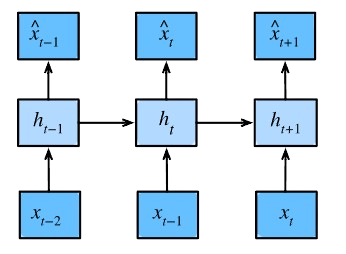
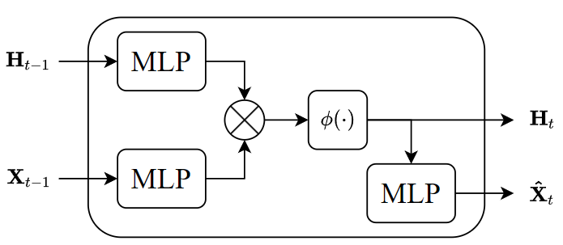

> TIME: 2023.12.16, Saturday, 🌞

# 序列数据

自然语言处理的文本数据实质上是序列数据的一种。所谓序列数据就是一组在时间亦或逻辑等方面存在一定关联性的数据。例如数字正弦序列，其各个点在时间上具有强相关性。这意味着我们在推理时需要将过去的数据信息也考虑进去，也就是说：
$$
x_t \sim P(x_t|x_{t-1},\cdots,x_0) \tag 1
$$
然而对于无限长序列，我们往往难以处理。我们可以近似地认为很久以前的事件往往对当下的影响很小，那么我们可以只考虑过去的几个数据信息：
$$
x_t \sim P(x_t|x_{t-1},\cdots,x_{t-\tau}) \tag 2
$$
这使得我们可以直接在序列数据上来训练一个MLP进行预测，这种称为自回归模型。然而这种模型在预测远期数据时会很容易将预测损失纳入，从而产生较大的偏差。

如果我们使用一个隐变量$h_t$对过去观测到的信息进行总结，通过隐变量$h_t$来估计$x_t$，这种模型称作隐变量自回归模型。RNN便是在此基础上构建的。

## 文本序列数据

文本序列数据最大的特点是一组有编码的数据，我们需要将其数值化。可以采取以下方式：

1. 分词，根据token将序列离散划分。
2. 编码，将划分出来的词元进行编码，同时保留编码映射。
3. One-hot，将每个编码序号one-hot化。有利于作为模型的输入，且消除了编码数值差异（1表示这个词元的概率是1）

# 循环神经网络

考虑隐变量自回归模型：
$$
x_t \sim P(x_t|x_{t-1},\cdots,x_0) \approx P(x_t|h_{t}) \tag 3
$$
我们希望$h_t$能够总结过去的经验，就是每次在有新输入时将既往经验与新知识融会贯通，也就是
$$
h_t = \phi(h_{t-1}, x_{t-1}) \tag 4
$$
采用流程图表示就是，可见隐变量$h_t$能够对既往数据进行归纳。



那么我们总结式$(3)(4)$，可以构建以下模型
$$
\begin{cases}
\mathbf{H}_t=\phi\left(\mathbf{X}_{t-1} \mathbf{W}_{x h}+\mathbf{H}_{t-1} \mathbf{W}_{h h}+\mathbf{b}_h\right)\\\\
\mathbf{\hat{X}}_t=\mathbf{H}_t \mathbf{W}_{h x}+\mathbf{b}_q 
\end{cases} \tag 5
$$
该模型首先根据过去的经验$h_{t-1}$与知识$x_{t-1}$总结新的经验$h_{t}$，然后根据新的经验$h_t$预测输出$\hat{x}_t$。如此循环往复，故名为循环神经网络。

对式$(5)$进行解析，可以总结出循环神经网络其实也是由MLP构成的



Pytorch中有专门的RNN模型可以调用

```python
rnn_layer = torch.nn.RNN(len(vocab), num_hiddens)
Y, state = rnn_layer(X, state)
```

