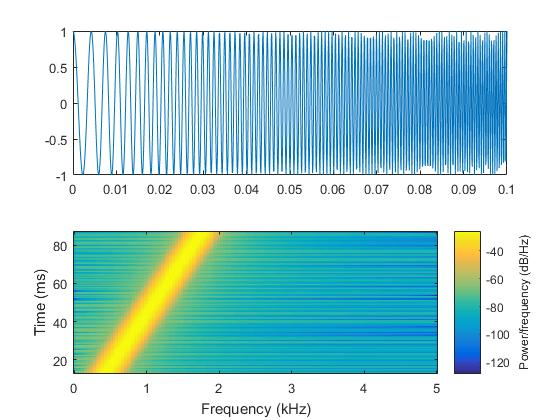

> TIME：2023.12.13，Wednesday，🌥️

# CHRIP波形与脉冲压缩技术

Chrip信号（**L**inear **F**requency **M**odulation Signal, LFM）是声呐的常用信号。相比于连续CW信号，他有着更大的带宽，能够提高声呐的距离分辨力。

在声呐定位中存在一组矛盾：作用距离与距离分辨力之间的矛盾。在声呐定位时如果要能够分辨两个目标需要使得两个目标的回波信号不发生重叠，根据反射定理我们很容易推断出距离分辨力为$\displaystyle\Delta r = \frac{c}{2B} = \frac{c\tau}{2}$。也就是说如果需要得到较优的距离分辨力，我们希望信号的持续时间$\tau$尽可能短，但是这回导致信号的能量降低。显然，信号能量的降低会影响到信号的作用距离。

而Chrip信号能够实现在相同的持续时间$\tau$下，信号的带宽增大（**拓频**）。同时，在回波信号经过匹配滤波后，信号的脉冲宽度将会大大缩短（**脉冲压缩**）。这使得我们得到了一种同时具备宽带与窄脉的技术。

# CHRIP波形

Chrip信号作为一种线性调频信号，它的表达式为
$$
s(t) = \mathrm{cos}(2\pi f_0 + \pi k t^2) = \mathrm{exp}(j(2\pi f_0 + \pi k t^2)) \tag 1
$$
则
$$
\begin{cases}
\displaystyle \theta(t) = 2\pi f_0 + \pi k t^2  \\
\displaystyle f(t) = \frac{d\theta}{dt}/2\pi = f_0+kt
\end{cases} \tag 2
$$
我们可以通过matlab轻松地观察其时频特性

```matlab
T = 0.1; % 脉冲时间
fs = 10000; % 采样率看
t=0 : 1/fs : T;
y=chirp(t,200,T,2000); % 第一个参数表示时间长度，第二个参数表示当t=0s时对应的频率，第三个和第四个参数为当t=0.05s时对应的频率
subplot(2,1,1); 
plot(t, y); 
subplot(2,1,2);
spectrogram(y,256,250,256,fs); 
```




