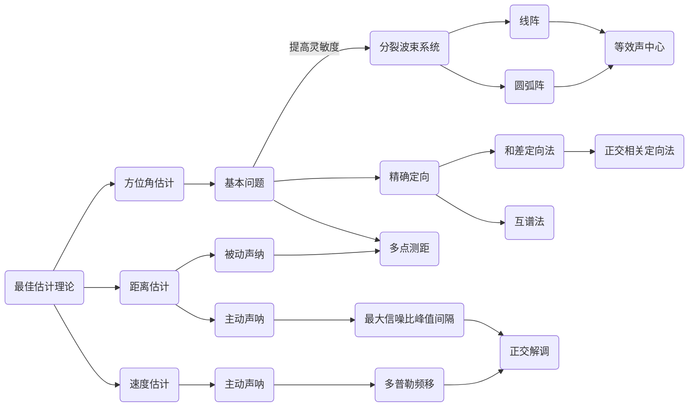
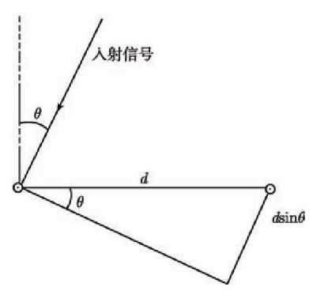
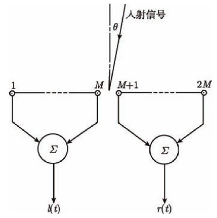
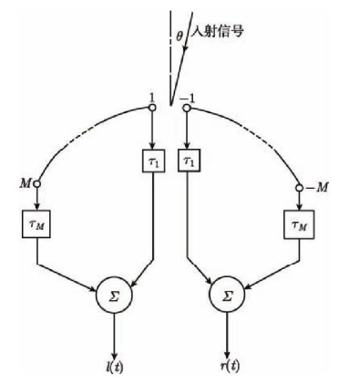
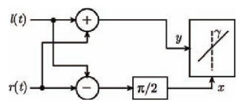
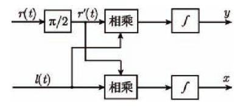
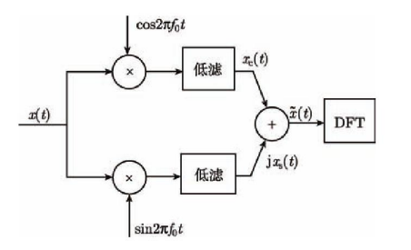
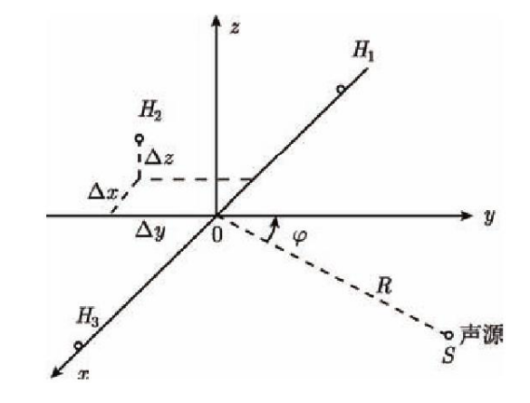

> TIME：2023.12.4，Monday，🌧️

# 声呐信号参量估计

参量估计是信号处理的另一个议题。我们希望从声呐信号中获取有效的信息以估计目标的方位角、速度和距离。我们需要关注的是估计的最优精度以及如何能够达到这种精度。幸运的是，概率论为我们指明了道路。在本节中，将会介绍声呐信号参量估计的相关原理。并说明如何对目标的方位角、速度和距离进行估计，以及其估计精度如何。

# 最佳估计理论

参量估计的过程则包括不断放宽对被观测信号的统计特性要求的三个过程：

1. [贝叶斯估计](https://blog.csdn.net/qq_32742009/article/details/81481680)；2. [最大似然估计](https://blog.csdn.net/qq_42233059/article/details/127076343)；3. [最小二乘估计](https://blog.csdn.net/buxinlegan/article/details/107355172)

参量估计对于估计量的统计特性有这无偏性、一致性、有效性的要求。

克拉默-拉奥定理给出了参量估计能够达到的最佳精度
$$
D(\hat{\theta}) 
\ge 
\frac{\left[ \frac{\partial\psi(\theta)} {\partial\theta} \right]^2}
{E\left\{ \left[ \frac{\partial \mathrm{ln}L(x|\theta)}{\partial\theta} \right]^2 \right\}} \tag 1
$$

如果估计量$\hat\theta$是无偏估计，那么

$$
\begin{aligned}
D(\hat\theta) & = D(\hat\theta - \theta) \\
			  & = E[(\hat\theta-\theta)^2] - E[(\hat\theta-\theta)]^2 \\
              & = E[(\hat\theta-\theta)^2] \\
              & \ge \left\{ E\left[ \frac{\partial \mathrm{ln}L(x|\theta)}{\partial\theta} \right]^2 \right\}^{-1} \\
              & =  \left\{ -E \left[ \frac{\partial^2 \mathrm{ln}L(x|\theta)}{\partial\theta^2} \right] \right\}^{-1} \\
\end{aligned} \tag 2
$$
**克拉默-拉奥下界唯一，且必然是最大似然估计量。**

如果对某一参数$\theta$进行$N$次独立的观测，观测误差服从高斯分布，那么最大似然估计就是$\theta_{ml} = \frac{1}{N}\sum_i^Nx_i$。

# 方位角估计-定向问题

方位角估计的基本问题是考虑两个接收基元。为了提高灵敏度，将进一步使用线阵或者圆弧阵这样的分裂波束系统进行定向。然而，方位角$\theta$是关于时延$\tau$的函数。对于任意随机信号的时延$\tau$的估计可以采用互谱法；而对于输入波形为CW波形时，我们可以采用一些精确定向法。

下表是线阵或者圆弧阵的相关结论的总结。

|                  |                             线阵                             |                            圆弧阵                            |
| :---------------: | :----------------------------------------------------------: | :----------------------------------------------------------: |
| $l(t)$           | $\displaystyle l(t) = A\mathrm{cos}(2\pi f_0 t+M\pi\frac{d}{\lambda}\mathrm{sin}\theta)$ | $\displaystyle l(t) = A\mathrm{cos}(2\pi f_0 t+\frac{-2\frac{r_0}{c}f_0\theta N_0}{M}[\mathrm{sin}(\frac{M}{2}\alpha_0)]^2) $ |
| $r(t)$           | $\displaystyle r(t) = A\mathrm{cos}(2\pi f_0 t+3M\pi\frac{d}{\lambda}\mathrm{sin}\theta)$ | $\displaystyle r(t) = A\mathrm{cos}(2\pi f_0 t+\frac{2\frac{r_0}{c}f_0\theta N_0}{M}[\mathrm{sin}(\frac{M}{2}\alpha_0)]^2) $ |
| $\Delta \varphi$ | $\displaystyle\Delta\varphi = 2M\pi\frac{d}{\lambda}\mathrm{sin}\theta $ | $\displaystyle \Delta\varphi = \frac{4\frac{r_0}{c}f_0\theta N_0}{M}[\mathrm{sin}(\frac{M}{2}\alpha_0)]^2$ |
| $\tau$           | $\displaystyle\tau = \frac{\Delta \varphi}{2\pi f_0} = Md \mathrm{sin}\theta/c$ | $\displaystyle \tau = \frac{\Delta \varphi}{2\pi f_0} = \frac{2\frac{r_0}{c}\theta N_0}{M\pi}[\mathrm{sin}(\frac{M}{2}\alpha_0)]^2$ |
| $\theta$         |   $\displaystyle\theta = \mathrm{arcsin}\frac{\tau c}{Md}$   | $\displaystyle \theta = \tau M\pi c/\left[ 2r_0\left( \mathrm{sin\frac{M}{2}\alpha_0} \right)^2N_0 \right]$ |

## 基本问题-延时测量

考虑最基本的两个接收基元问题

如果两个接收基元的距离为$d$，那么两个基元接收到信号的时延将会是
$$
\tau = d \mathrm{sin}\theta/c \tag 3
$$
也就是说，我们需要先估计时延，然后反过来相位角。

已知两个接收基元接收到的信号将分别为
$$
\begin{cases}
x_1(t) = s_1(t)+n_1(t) \\\\
x_2(t) = s_1(t+\tau)+n_2(t) 
\end{cases} \tag 4
$$
**那么两个信号的互功率谱为$K_{x_1x_2}(f) = K_{ss}(f)e^{j2\pi f\tau}$，所以时延$\tau$的估计量为**
$$
\hat\tau = \frac{1}{2\pi f}\mathrm{arctan}\left\{ \frac{\mathrm{Im}[K_{x_1x_2}(f)]}{\mathrm{Re}[K_{x_1x_2}(f)]} \right\} \tag 5
$$
这种方法叫互谱法，其观测的克拉默-拉奥下界为
$$
\mathrm{min}[\mathrm{Var}(\hat\tau)] = \left\{ 2T\int^\infin_0 (2\pi f)^2\frac{|r(f)|^2}{1-|r(f)|^2}df \right\}^{-1} \tag 6
$$
在输入信噪比较低时，且噪声谱与信号谱在$(f_1, f_2)$上平坦，那么上式可以改写为
$$
\mathrm{min}[\Delta\hat\tau] = \left( \frac{3}{8\pi^2T} \right)^{1/2}\frac{1}{\mathrm{SNR}}\frac{1}{\sqrt{f_2^3-f_1^3}} \tag 7
$$

## 基本问题的引申-分裂波束系统

### 线阵分裂波束系统

在两个接收基元问题的定向问题中，信号时延为$\tau = d \mathrm{sin}\theta/c$，这意味着，输入信号小角度的变化不会带来信号时延的大变化。为了提高对目标定向的灵敏度，可以考虑分裂波束系统，最简单的就是线阵。

考虑左右各有$M$个基元的线阵

假设输入信号为单频连续波$\mathrm{cos}2\pi f_0t$，则第$i$个基元接收到的信号为
$$
s_i(t) = cos\{ 2\pi f_0[t+\tau_i(\theta)] \},\quad \tau_i(\theta) = (i-1)d\mathrm{sin}\theta/c \tag 8
$$
由积化和差得，左侧基阵接收到的和信号为
$$
l(t) = \left( \sum_{i=1}^M u_i \right)\mathrm{cos}(2\pi f_0 t)-\left( \sum_{i=1}^M v_i \right)\mathrm{sin}(2\pi f_0 t) = A\mathrm{cos}(2\pi f_0 t+a) \tag 9 \\
\begin{cases}
u_i = \mathrm{cos}[2\pi f_0 \tau_i(\theta)]\\\\
v_i = \mathrm{sin}[2\pi f_0 \tau_i(\theta)]
\end{cases}
\\
\begin{cases}
A = \left[ \left( \sum_{i=1}^M u_i \right)^2 + \left( \sum_{i=1}^M v_i \right)^2 \right]^{1/2}\\
a = \mathrm{arctan}\left(\sum_{i=1}^M u_i / \sum_{i=1}^M v_i\right)
\end{cases}
$$
记$\psi = \frac{2\pi d}{\lambda}\mathrm{sin}\theta$，那么由和差化积有
$$
a = \mathrm{arctan}\frac{\sum_{i=1}^M u_i}{\sum_{i=1}^M v_i} = \mathrm{arctan}\frac{\mathrm{sin}\left( \frac{M}{2}\psi \right)}{\mathrm{cos}\left( \frac{M}{2}\psi \right)} = M\pi \frac{d}
{\lambda}\mathrm{sin}\theta \tag {10}
$$
也就是说
$$
l(t) = A\mathrm{cos}(2\pi f_0 t+M\pi\frac{d}{\lambda}\mathrm{sin}\theta) \tag {11}
$$
同理，右侧基阵接收到的和信号为
$$
r(t) = A\mathrm{cos}(2\pi f_0 t+3M\pi\frac{d}{\lambda}\mathrm{sin}\theta) \tag {12}
$$
两个信号的相位差和时延便是
$$
\begin{cases}
\Delta\varphi = 2M\pi\frac{d}{\lambda}\mathrm{sin}\theta\\\\
\tau = \frac{\Delta \varphi}{2\pi f_0} = Md \mathrm{sin}\theta/c \tag {13}
\end{cases}
$$
这样输入信号小角度的变化便能够带来信号时延的大变化。这种估计的最好精度为
$$
\mathrm{Var}(\hat\tau) = \frac{2\pi}{T}\left\{ \int^\infin _0\frac{M\omega^2K_{ss}^2(\omega)/K_{nn}^2(\omega)}{1+MK_{ss}^2(\omega)/K_{nn}^2(\omega)}dw \right\}^{-1} \tag{14}
$$

### 圆弧阵分裂波束系统

考虑左右各有$M$个基元，相邻基元夹角为$\alpha_0 = 2\pi/N$，半径为$r_0$的圆弧阵

假设输入信号为单频连续波$\mathrm{cos}2\pi f_0t$，则第$i$个基元接收到的信号为
$$
s_i(t) = cos\{ 2\pi f_0[t+\tau_i(\theta)] \},\quad 
\tau_i(\theta) = \frac{r_0}{c}\mathrm{cos}\left[\theta+\frac{\alpha_0}{2}+(i-1)\alpha_0\right]
\tag {15}
$$
类似于线阵，有
$$
l(t) = \left( \sum_{i=1}^M u_i \right)\mathrm{cos}(2\pi f_0 t)-\left( \sum_{i=1}^M v_i \right)\mathrm{sin}(2\pi f_0 t) = A\mathrm{cos}(2\pi f_0 t+a) \\
\begin{cases}
u_i = \mathrm{cos}\{2\pi f_0 [\tau_i(\theta)-\tau_i(0)]\}\\\\
v_i = \mathrm{sin}\{2\pi f_0 [\tau_i(\theta)-\tau_i(0)]\}
\end{cases}
\\
\begin{cases}
A = \left[ \left( \sum_{i=1}^M u_i \right)^2 + \left( \sum_{i=1}^M v_i \right)^2 \right]^{1/2}\\\\
a = \mathrm{arctan}\left(\sum_{i=1}^M u_i / \sum_{i=1}^M v_i\right)
\end{cases}  \tag {16}
$$
**在精确定向问题中，$\theta$往往很小**，因此做出以下化简（推导过程略）
$$
a 
= \mathrm{arctan}\frac{\sum_{i=1}^M u_i}{\sum_{i=1}^M v_i} 
\approx \mathrm{arctan}\frac{-2\frac{r_0}{c}f_0\theta N_0[\mathrm{sin}(\frac{M}{2}\alpha_0)]^2}{M}
\approx \frac{-2\frac{r_0}{c}f_0\theta N_0}{M}\left[\mathrm{sin}\left(\frac{M}{2}\alpha_0\right)\right]^2 \tag{17}
$$
所以，左侧基阵的和信号为
$$
l(t) = A\mathrm{cos}\left(2\pi f_0 t+\frac{-2\frac{r_0}{c}f_0\theta N_0}{M}\left[\mathrm{sin}\left(\frac{M}{2}\alpha_0\right)\right]^2\right) \tag {18}
$$
同理，右侧基阵接收到的和信号为
$$
r(t) = A\mathrm{cos}\left(2\pi f_0 t+\frac{2\frac{r_0}{c}f_0\theta N_0}{M}\left[\mathrm{sin}\left(\frac{M}{2}\alpha_0\right)\right]^2\right) \tag {18}
$$
两个信号的相位差和时延便是
$$
\begin{cases}
\displaystyle\Delta\varphi = \frac{4\frac{r_0}{c}f_0\theta N_0}{M}\left[\mathrm{sin}\left(\frac{M}{2}\alpha_0\right)\right]^2\\\\
\displaystyle\tau = \frac{\Delta \varphi}{2\pi f_0} = \frac{2\frac{r_0}{c}\theta N_0}{M\pi}\left[\mathrm{sin}\left(\frac{M}{2}\alpha_0\right)\right]^2 \tag {19}
\end{cases}
$$

## 实现方法-精确定向法

在分裂波束系统中，我们考虑的输入波形为单频连续波$\mathrm{cos}2\pi f_0t$，且推导出左右等效波形实际是两个有一定相位差的CW波。而我们关心的时延实际上也就是CW波的相位差。我们可以通过和差定向法以及正相关定向法来直接测量相位差。

假定
$$
l(t) = \mathrm{cos}(2\pi f_0 t-\varphi),\quad r(t) = \mathrm{cos}(2\pi f_0 t) \tag {20}
$$

### 和差定向法

和差定向法的原理框图为，其中的$\pi/2$可以视作是微分器

易知
$$
x(t) = 2\mathrm{cos}\left( 2\pi f_0 t -\frac{\varphi}{2} \right)\mathrm{sin}\frac{\varphi}{2} \\
y(t) = 2\mathrm{cos}\left( 2\pi f_0 t -\frac{\varphi}{2} \right)\mathrm{cos}\frac{\varphi}{2} \tag{21}
$$
可见显示的直线的偏离角就是两路信号的相位差的半值$\varphi/2$。但是显然的是，如果和差放大器存在相移，那么显示的图像将变成椭圆形。

### 正交相关定向法

和差定向法的灵敏度并不高，故进一步提出了正交相关定向法

易知
$$
x(t) = E[r'(t)l(t)] = \mathrm{sin}\varphi \\\\
y(t) = E[r(t)l(t)] = \mathrm{cos}\varphi \tag{22}
$$
可见显示的直线的偏离角就是两路信号的相位差$\varphi$，灵敏度提高了一倍。同时，由于积分器的存在，显示背景将更干净。

# 主动声呐的距离、速度估计

## 原理

由[声呐系统概述](public_docs/dsp/sonar_signal_processing/声呐系统介绍.md)这节可知，主动声呐的信号是窄带信号，可以表示为
$$
\tilde{x}(t) = x_c(t) + j x_s(t) \\
x(t) = Re[\tilde{x}(t)e^{j2\pi f_0 t}] \tag{23}
$$
当主动声呐发射出信号后，经过时延$\tau$后会再次接收到信号，且信号可能会因为多普勒效应而存在一定的频移$f_d$，因此接收到的信号为
$$
\tilde{r}(t) = \tilde{x}_r(t) + \tilde{n}(t)=  \tilde{\beta}\tilde{x}(t-\tau_a)\mathrm{exp}(j2\pi f_d\tau_a) + \tilde{n}(t) \tag {24}
$$
因此主动声呐的距离、速度估计实际上是估计时延$\tau$和频移$f_d$。

由于主动声呐采用最大信噪比(匹配滤波器)进行信号检测，那么时延$\tau$的估计可以根据信号发送时间和能量检测器出现峰值的时间间隔来确定（？未定。后续参考相关文献后修改），频移$f_d$则可以通过频谱测定。

------------------------

根据窄带信号的特点，我们可以采取正交解调的方式，取出包络的实部和虚部，然后进行DFT即可获得包络$\tilde{\beta}\tilde{x}(t-\tau_a)\mathrm{exp}(j2\pi f_d\tau_a)$的相关频谱。分析相关频谱即可估计出目标的距离和速度。

正交解调法框图为

## 精度

我们关心估计的精度如何，可以计算得到似然函数
$$
L(\tau, f) = \mathrm{ln}\left[ \mathrm{I}_0 \left( \frac{2\sqrt{E_r}}{N_0}|\tilde{y}(t)| \right)\right] \tag{25}
$$
其中$I_0(x)$是0阶修正贝塞尔函数，$E_r$是接收信号$\tilde{x}_r(t)$的能量$\displaystyle E_r = \int _{-\infin}^\infin|\tilde{x}_r(t)|^2dt$，$\tilde{y}(t)$是匹配滤波器的输出。

**在大信噪比下**，式$(25)$可以化简为
$$
\begin{aligned}
L(\tau, f) & \approx \frac{2\sqrt{E_r}}{N_0}\left|\tilde{y}(t)\right| \\
		   & = \frac{2\sqrt{E_r}}{N_0}\left|\tilde{x}(t)*\tilde{h}(t)\right| \\	
		   & = \frac{2\sqrt{E_r}}{N_0}\left| \int_{-\infin}^{\infin} [\tilde{\beta}\tilde{x}(t-\tau_a)\mathrm{exp}(j2\pi f_d\tau_a) + \tilde{n}(t)][\tilde{x}(t-\tau)\mathrm{exp}(j2\pi ft)]^*dt \right|\\
		   & = \frac{2\sqrt{E_r}}{N_0}\left| \int_{-\infin}^{\infin} \tilde{\beta}\tilde{x}(t-\tau_a)\tilde{x}^*(t-\tau)\mathrm{exp}[j2\pi (f-f_d)t)]dt \right| \\
		   & = \frac{2\sqrt{E_r}}{N_0}\left|\chi(\tau_a-\tau, f_d-f)\right| 
\end{aligned} \tag{26}
$$
那么无多普勒频移时的时延估计的克拉默-拉奥下限为
$$
\mathrm{min}[\mathrm{Var}(\tilde{\tau})] = \left\{ \frac{2E_r}{N_0} \beta^2 \right\}^{-1} = \frac{3}{8\pi^2T} \frac{1}{\mathrm{SNR}}\frac{1}{f_2^3-f_1^3} \tag {27}
$$
其中$\beta$为为等效带宽，$\displaystyle \beta^2 = \frac{2\int_{f_1}^{f_2}(2\pi f)^2\frac{S_0}{2}df}{2\int_{f_1}^{f_2}\frac{S_0}{2}df}$

无时延时的多普勒频移估计的克拉默-拉奥下限为
$$
\mathrm{min}[\mathrm{Var}(\tilde{f})] = \left\{ \frac{2E_r}{N_0} t_d^2 \right\}^{-1} \tag{28}
$$
其中$t_d$为等效时间长度，$\displaystyle t_d^2 = \frac{\int_0^{T}t^2|\tilde{y}(t)|^2dt-[\int_0^{T}t^2|\tilde{y}(t)|^2dt]^2}{\int_0^{T}|\tilde{y}(t)|^2dt}$

# 被动声呐的距离探测

原理

被动声呐的测距原理是方位角测定的拓展。我们知道两个接收基元可以测定目标的对于这两个接收基元的方位角，如果再加上一个接收基元则可以谋定三个方位角。

考虑以下一般情况的三点测距，记$R=R_2=SH_2$

通过解析几何我们可以得知
$$
\begin{cases}
\displaystyle\varphi = \mathrm{arcsin}\left( \frac{c\tau_{12}}{d_1}\right) = \mathrm{arcsin}\left( \frac{c\tau_{23}}{d_2} \right) - \alpha \\\\
\displaystyle R = \frac{d_1^2\mathrm{cos}^2\varphi+d_2^2\mathrm{cos}^2(\varphi+\alpha)}{2c(\tau_{12}-\tau_{23})+2l} 
\displaystyle\quad\quad\mathrm{with.}\quad l=d_2\mathrm{sin}(\varphi+\alpha) - d_1\mathrm{sin\varphi} 
\end{cases} \tag{29}
$$
其中对于时延$\tau$的估计可以参考[方位角估计的过程](# 方位角估计-定向问题)

**当对于直线阵**，即$\displaystyle d_1=d_2=d$，$\alpha=0$时，式$(29)$可以化简为
$$
\begin{cases}
\displaystyle\varphi = \mathrm{arcsin}\left[ \frac{c(\tau_{12}+\tau_{23})}{2d} \right] \\\\
\displaystyle R = \frac{d^2\mathrm{cos}^2\varphi}{2c(\tau_{12}-\tau_{23})}
\end{cases} \tag{30}
$$
然而，我们的声呐在安装时总会有一定的误差。对于直线阵，如果声呐的载体有一定的纵倾角$\psi$和横摇角$\theta$，那么式$(30)$应修正为
$$
\begin{cases}
\displaystyle\varphi = \mathrm{arcsin}\left[ \frac{c(\tau_{12}+\tau_{23})}{2d\mathrm{cos}\psi} \right] \\\\
\displaystyle R = \frac{d^2\mathrm{cos}^2\varphi\mathrm{cos}^2\psi}{2c(\tau_{12}-\tau_{23})+2l} \quad\quad\mathrm{with.}\quad 
\begin{aligned}
l 
& =\Delta x(\mathrm{sin}\psi\mathrm{sin}\varphi) \\
& +\Delta y(\mathrm{sin}\theta\mathrm{sin}\psi\mathrm{sin}\varphi +\mathrm{cos}\theta\mathrm{cos}\varphi)\\
& +\Delta z(\mathrm{sin}\theta\mathrm{cos}\varphi-\mathrm{cos}\theta\mathrm{sin}\psi\mathrm{sin}\varphi)
\end{aligned}
\end{cases} \tag{31}
$$

## 精度

同样，我们仍然关心测距的精度。

对于直线阵的距离估计$\displaystyle \hat R = \frac{d^2\mathrm{cos}^2\varphi}{2c(\hat \tau_{12}-\hat \tau_{23})}$，可以得到估计量的方差为
$$
\mathrm{Var}(\hat R) = c^2\frac{\mathrm{Var}(\hat\tau_{12}) + \mathrm{Var}(\hat\tau_{23})}{R/d\mathrm{cos}\varphi} \tag{32}
$$
其中时延的误差可以参照式$(7)$。

