> TIME：2023.12.4，Monday，🌧️

# 声呐信号参量估计

参量估计是信号处理的另一个议题。我们希望从声呐信号中获取有效的信息以估计目标的方位角、速度和距离。我们需要关注的是估计的最优精度以及如何能够达到这种精度。幸运的是，概率论为我们指明了道路。在本节中，将会介绍声呐信号参量估计的相关原理。并说明如何对目标的方位角、速度和距离进行估计。

```mermaid
graph LR
id1(最佳估计理论) --> id2(方位角估计)
id2-->id21(基本问题)
id21--提高灵敏度-->id22(分裂波束系统)
id22-->id27(线阵)
id22-->id28(圆弧阵)
id21-->id23(精确定向)
id23-->id24(和差定向法)
id23-->id25(正交相关定向法)
id23-->id26(互谱法)

```

# 最佳估计理论

参量估计的过程则包括不断放宽对被观测信号的统计特性要求的三个过程：

1. [贝叶斯估计](https://blog.csdn.net/qq_32742009/article/details/81481680)；2. [最大似然估计](https://blog.csdn.net/qq_42233059/article/details/127076343)；3. [最小二乘估计](https://blog.csdn.net/buxinlegan/article/details/107355172)

参量估计对于估计量的统计特性有这无偏性、一致性、有效性的要求。

克拉默-拉奥定理给出了参量估计能够达到的最佳精度
$$
D(\hat{\theta}) 
\ge 
\frac{\left[ \frac{\partial\psi(\theta)} {\partial\theta} \right]^2}
{E\left\{ \left[ \frac{\partial \mathrm{ln}L(x|\theta)}{\partial\theta} \right]^2 \right\}} \tag 1
$$

如果估计量$\hat\theta$是无偏估计，那么

$$
\begin{aligned}
D(\hat\theta) & = D(\hat\theta - \theta) \\
			  & = E[(\hat\theta-\theta)^2] - E[(\hat\theta-\theta)]^2 \\
              & = E[(\hat\theta-\theta)^2] \\
              & \ge \left\{ E\left[ \frac{\partial \mathrm{ln}L(x|\theta)}{\partial\theta} \right]^2 \right\}^{-1} \\
              & =  \left\{ -E \left[ \frac{\partial^2 \mathrm{ln}L(x|\theta)}{\partial\theta^2} \right] \right\}^{-1} \\
\end{aligned} \tag 2
$$
**克拉默-拉奥下界唯一，且必然是最大似然估计量。**

如果对某一参数$\theta$进行$N$次独立的观测，观测误差服从高斯分布，那么最大似然估计就是$\theta_{ml} = \frac{1}{N}\sum_i^Nx_i$。

# 方位角估计-定向问题

方位角估计的基本问题是考虑两个接收基元。为了提高灵敏度，将进一步使用线阵或者圆弧阵这样的分裂波束系统进行定向。然而，方位角$\theta$是关于时延$\tau$的函数。对于任意随机信号的时延$\tau$的估计可以采用互谱法；而对于输入波形为CW波形时，我们可以采用一些精确定向法。

下表是线阵或者圆弧阵的相关结论的总结。

|                  |                             线阵                             |                            圆弧阵                            |
| :---------------: | :----------------------------------------------------------: | :----------------------------------------------------------: |
| $l(t)$           | $\displaystyle l(t) = A\mathrm{cos}(2\pi f_0 t+M\pi\frac{d}{\lambda}\mathrm{sin}\theta)$ | $\displaystyle l(t) = A\mathrm{cos}(2\pi f_0 t+\frac{-2\frac{r_0}{c}f_0\theta N_0}{M}[\mathrm{sin}(\frac{M}{2}\alpha_0)]^2) $ |
| $r(t)$           | $\displaystyle r(t) = A\mathrm{cos}(2\pi f_0 t+3M\pi\frac{d}{\lambda}\mathrm{sin}\theta)$ | $\displaystyle r(t) = A\mathrm{cos}(2\pi f_0 t+\frac{2\frac{r_0}{c}f_0\theta N_0}{M}[\mathrm{sin}(\frac{M}{2}\alpha_0)]^2) $ |
| $\Delta \varphi$ | $\displaystyle\Delta\varphi = 2M\pi\frac{d}{\lambda}\mathrm{sin}\theta $ | $\displaystyle \Delta\varphi = \frac{4\frac{r_0}{c}f_0\theta N_0}{M}[\mathrm{sin}(\frac{M}{2}\alpha_0)]^2$ |
| $\tau$           | $\displaystyle\tau = \frac{\Delta \varphi}{2\pi f_0} = Md \mathrm{sin}\theta/c$ | $\displaystyle \tau = \frac{\Delta \varphi}{2\pi f_0} = \frac{2\frac{r_0}{c}\theta N_0}{M\pi}[\mathrm{sin}(\frac{M}{2}\alpha_0)]^2$ |
| $\theta$         |   $\displaystyle\theta = \mathrm{arcsin}\frac{\tau c}{Md}$   | $\displaystyle \theta = \tau M\pi c/\left[ 2r_0\left( \mathrm{sin\frac{M}{2}\alpha_0} \right)^2N_0 \right]$ |

## 基本问题

考虑最基本的两个接收基元问题

如果两个接收基元的距离为$d$，那么两个基元接收到信号的时延将会是
$$
\tau = d \mathrm{sin}\theta/c \tag 3
$$
也就是说，我们需要先估计时延，然后反过来相位角。

已知两个接收基元接收到的信号将分别为
$$
\begin{cases}
x_1(t) = s_1(t)+n_1(t) \\\\
x_2(t) = s_1(t+\tau)+n_2(t) 
\end{cases} \tag 4
$$
**那么两个信号的互功率谱为$K_{x_1x_2}(f) = K_{ss}(f)e^{j2\pi f\tau}$，所以时延$\tau$的估计量为**
$$
\hat\tau = \frac{1}{2\pi f}\mathrm{arctan}\left\{ \frac{\mathrm{Im}[K_{x_1x_2}(f)]}{\mathrm{Re}[K_{x_1x_2}(f)]} \right\} \tag 5
$$
这种方法叫互谱法，其观测的克拉默-拉奥下界为
$$
\mathrm{min}[\mathrm{Var}(\hat\tau)] = \left\{ 2T\int^\infin_0 (2\pi f)^2\frac{|r(f)|^2}{1-|r(f)|^2}df \right\}^{-1} \tag 6
$$
在输入信噪比较低时，且噪声谱与信号谱在$(f_1, f_2)$上平坦，那么上式可以改写为
$$
\mathrm{min}[\Delta\hat\tau] = \left( \frac{3}{8\pi^2T} \right)^{1/2}\frac{1}{\mathrm{SNR}}\frac{1}{\sqrt{f_2^3-f_1^3}} \tag 7
$$

## 分裂波束系统

### 线阵分裂波束系统

在两个接收基元问题的定向问题中，信号时延为$\tau = d \mathrm{sin}\theta/c$，这意味着，输入信号小角度的变化不会带来信号时延的大变化。为了提高对目标定向的灵敏度，可以考虑分裂波束系统，最简单的就是线阵。

考虑左右各有$M$个基元的线阵

假设输入信号为单频连续波$\mathrm{cos}2\pi f_0t$，则第$i$个基元接收到的信号为
$$
s_i(t) = cos\{ 2\pi f_0[t+\tau_i(\theta)] \},\quad \tau_i(\theta) = (i-1)d\mathrm{sin}\theta/c \tag 8
$$
由积化和差得，左侧基阵接收到的和信号为
$$
l(t) = \left( \sum_{i=1}^M u_i \right)\mathrm{cos}(2\pi f_0 t)-\left( \sum_{i=1}^M v_i \right)\mathrm{sin}(2\pi f_0 t) = A\mathrm{cos}(2\pi f_0 t+a) \tag 9 \\
\begin{cases}
u_i = \mathrm{cos}[2\pi f_0 \tau_i(\theta)]\\\\
v_i = \mathrm{sin}[2\pi f_0 \tau_i(\theta)]
\end{cases}
\\
\begin{cases}
A = \left[ \left( \sum_{i=1}^M u_i \right)^2 + \left( \sum_{i=1}^M v_i \right)^2 \right]^{1/2}\\
a = \mathrm{arctan}\left(\sum_{i=1}^M u_i / \sum_{i=1}^M v_i\right)
\end{cases}
$$
记$\psi = \frac{2\pi d}{\lambda}\mathrm{sin}\theta$，那么由和差化积有
$$
a = \mathrm{arctan}\frac{\sum_{i=1}^M u_i}{\sum_{i=1}^M v_i} = \mathrm{arctan}\frac{\mathrm{sin}\left( \frac{M}{2}\psi \right)}{\mathrm{cos}\left( \frac{M}{2}\psi \right)} = M\pi \frac{d}{\lambda}\mathrm{sin}\theta \tag {10}
$$
也就是说
$$
l(t) = A\mathrm{cos}(2\pi f_0 t+M\pi\frac{d}{\lambda}\mathrm{sin}\theta) \tag {11}
$$
同理，右侧基阵接收到的和信号为
$$
r(t) = A\mathrm{cos}(2\pi f_0 t+3M\pi\frac{d}{\lambda}\mathrm{sin}\theta) \tag {12}
$$
两个信号的相位差和时延便是
$$
\begin{cases}
\Delta\varphi = 2M\pi\frac{d}{\lambda}\mathrm{sin}\theta\\\\
\tau = \frac{\Delta \varphi}{2\pi f_0} = Md \mathrm{sin}\theta/c \tag {13}
\end{cases}
$$
这样输入信号小角度的变化便能够带来信号时延的大变化。这种估计的最好精度为
$$
\mathrm{Var}(\hat\tau) = \frac{2\pi}{T}\left\{ \int^\infin _0\frac{M\omega^2K_{ss}^2(\omega)/K_{nn}^2(\omega)}{1+MK_{ss}^2(\omega)/K_{nn}^2(\omega)}dw \right\}^{-1} \tag{14}
$$

### 圆弧阵分裂波束系统

考虑左右各有$M$个基元，相邻基元夹角为$\alpha_0 = 2\pi/N$，半径为$r_0$的圆弧阵

假设输入信号为单频连续波$\mathrm{cos}2\pi f_0t$，则第$i$个基元接收到的信号为
$$
s_i(t) = cos\{ 2\pi f_0[t+\tau_i(\theta)] \},\quad 
\tau_i(\theta) = \frac{r_0}{c}\mathrm{cos}[\theta+\frac{\alpha_0}{2}+(i-1)\alpha_0]
\tag {15}
$$
类似于线阵，有
$$
l(t) = \left( \sum_{i=1}^M u_i \right)\mathrm{cos}(2\pi f_0 t)-\left( \sum_{i=1}^M v_i \right)\mathrm{sin}(2\pi f_0 t) = A\mathrm{cos}(2\pi f_0 t+a) \tag {16} \\
\begin{cases}
u_i = \mathrm{cos}\{2\pi f_0 [\tau_i(\theta)-\tau_i(0)]\}\\\\
v_i = \mathrm{sin}\{2\pi f_0 [\tau_i(\theta)-\tau_i(0)]\}
\end{cases}
\\
\begin{cases}
A = \left[ \left( \sum_{i=1}^M u_i \right)^2 + \left( \sum_{i=1}^M v_i \right)^2 \right]^{1/2}\\
a = \mathrm{arctan}\left(\sum_{i=1}^M u_i / \sum_{i=1}^M v_i\right)
\end{cases}
$$
**在精确定向问题中，$\theta$往往很小**，因此做出以下化简（推导过程略）
$$
a 
= \mathrm{arctan}\frac{\sum_{i=1}^M u_i}{\sum_{i=1}^M v_i} 
\approx \mathrm{arctan}\frac{-2\frac{r_0}{c}f_0\theta N_0[\mathrm{sin}(\frac{M}{2}\alpha_0)]^2}{M}
\approx \frac{-2\frac{r_0}{c}f_0\theta N_0}{M}[\mathrm{sin}(\frac{M}{2}\alpha_0)]^2 \tag{17}
$$
所以，左侧基阵的和信号为
$$
l(t) = A\mathrm{cos}(2\pi f_0 t+\frac{-2\frac{r_0}{c}f_0\theta N_0}{M}[\mathrm{sin}(\frac{M}{2}\alpha_0)]^2) \tag {18}
$$
同理，右侧基阵接收到的和信号为
$$
r(t) = A\mathrm{cos}(2\pi f_0 t+\frac{2\frac{r_0}{c}f_0\theta N_0}{M}[\mathrm{sin}(\frac{M}{2}\alpha_0)]^2) \tag {18}
$$
两个信号的相位差和时延便是
$$
\begin{cases}
\Delta\varphi = \frac{4\frac{r_0}{c}f_0\theta N_0}{M}[\mathrm{sin}(\frac{M}{2}\alpha_0)]^2\\\\
\tau = \frac{\Delta \varphi}{2\pi f_0} = \frac{2\frac{r_0}{c}\theta N_0}{M\pi}[\mathrm{sin}(\frac{M}{2}\alpha_0)]^2 \tag {19}
\end{cases}
$$

## 精确定向法

在分裂波束系统中，我们考虑的输入波形为单频连续波$\mathrm{cos}2\pi f_0t$，且推导出左右等效波形实际是两个有一定相位差的CW波。而我们关心的时延实际上也就是CW波的相位差。我们可以通过和差定向法以及正相关定向法来直接测量相位差。

假定
$$
l(t) = \mathrm{cos}(2\pi f_0 t-\varphi),\quad r(t) = \mathrm{cos}(2\pi f_0 t) \tag {20}
$$

### 和差定向法

和差定向法的原理框图为，其中的$\pi/2$可以视作是微分器

易知
$$
x(t) = 2\mathrm{cos}\left( 2\pi f_0 t -\frac{\varphi}{2} \right)\mathrm{sin}\frac{\varphi}{2} \\
y(t) = 2\mathrm{cos}\left( 2\pi f_0 t -\frac{\varphi}{2} \right)\mathrm{cos}\frac{\varphi}{2} \tag{21}
$$
可见显示的直线的偏离角就是两路信号的相位差的半值$\varphi/2$。但是显然的是，如果和差放大器存在相移，那么显示的图像将变成椭圆形。

### 正交相关定向法

和差定向法的灵敏度并不高，故进一步提出了正交相关定向法

易知
$$
x(t) = E[r'(t)l(t)] = \mathrm{sin}\varphi \\
y(t) = E[r(t)l(t)] = \mathrm{cos}\varphi
$$
可见显示的直线的偏离角就是两路信号的相位差$\varphi$，灵敏度提高了一倍。同时，由于积分器的存在，显示背景将更干净。
