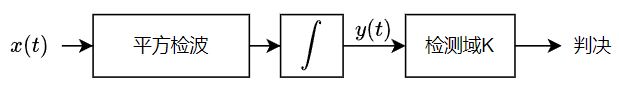

> TIME： 2023.11.30，Thursday，⛅

# 声呐信号检测基础

在[声呐系统介绍](声呐系统介绍.md)中提到声呐接收机由接收基阵、动态压缩范围、波束成形、信号处理等结构组成，本节便简要介绍信号处理的相关内容。在声呐方程中提及空间增益$GS$与时间增益$GT$，其中时间增益（又称后置积累）便源自于信号处理过程。

本节将先简要介绍检测理论，在此基础上说明声呐信号检测原理并计算对应的时间增益。

# 最佳估计理论与检测理论

信号处理的任务包括信号的检测与参量估计。

[假设检验](https://zhuanlan.zhihu.com/p/391319719)是信号检测的重要统计工具。在此基础上引出的极大似然判决的定义为
$$
\frac{p_1(x)}{p_0(x)}\begin{cases}
\ge Z_0,\quad H_1为真 \\
< Z_0,\quad H_0为真
\end{cases} \tag 1
$$
在通信原理中对数字调制方法的误码率估算便是以极大似然准则为基础进行的。

最佳检测准则包括：

* 最小总错误概率准则
* 最大似然比准则(ML) $\to$ 被动声呐
* 最大信噪比准则(MSN) $\to$ 主动声纳
* 最大均方差准则(LMS) $\to$ 自适应波束成形

# 信号检测

## 被动声呐信号检测

被动声呐检测的是目标舰艇的辐射噪声，该噪声淹没在自然噪声中，服从高斯分布。

**被动声呐检测采用的时最大似然比准则(ML)。**假定自然噪声的能量为$\sigma_n$，舰艇辐射噪声的能量为$\sigma_s$，那么当存在舰艇辐射噪声时信号的总能量为$\sqrt{\sigma_n^2+\sigma_s^2}$。则有、无舰艇辐射噪声时的

信号概率密度函数分别为
$$
p_0(x_1,\cdots,x_n) = \frac{1}{(2\pi\sigma_n^2)^{n/2}}\mathrm{exp}\left[ -\frac{x_1^2+\cdots+x_n^2}{2\sigma_n^2} \right] \tag 3
$$

$$
p_1(x_1,\cdots,x_n) = \frac{1}{(2\pi(\sigma_n^2+\sigma_s^2))^{n/2}}\mathrm{exp}\left[ -\frac{x_1^2+\cdots+x_n^2}{2(\sigma_n^2+\sigma_s^2)} \right] \tag 4
$$

则似然比函数为
$$
\begin{aligned}
L(x_1,\cdots,x_n) & = \frac{p_1(x_1,\cdots,x_n)}{p_0(x_1,\cdots,x_n)} \\
				  & = \left( \frac{\sigma_n}{\sqrt{\sigma_n^2+\sigma_s^2}} \right)^n \mathrm{exp} \left[ \frac{\sigma_s^2}{2(\sigma_n^2+\sigma_n^2)\sigma_n^2} \times (x_1^2+\cdots+x_n^2)\right] 
\end{aligned} \tag 5
$$
则接收域为
$$
\begin{aligned}
X_1 & = \{ (x_1,\cdots,x_n):L(x_1,\cdots,x_n) \ge Z_0 \} \\
	& = \left\{ (x_1,\cdots,x_n): \frac{x_1^2+\cdots+x_n^2}{n} \ge \frac{2\sigma_n^2(\sigma_n^2+\sigma_s^2)}{n\sigma_s^2}\times\mathrm{ln} \left[ Z_0 \left( \frac{\sqrt{\sigma_n^2+\sigma_s^2}}{\sigma_n} \right)^n \right] \right\}
\end{aligned} \tag 6
$$
上式中$\frac{x_1^2+\cdots+x_n^2}{n}$便是对采集样本先平方后积分，当积分值超过预设值的阈值后，便可以认为信号中存在舰艇辐射噪声。

因此检测器的结构为平方检波+积分器。

接下来分析该检测器的时间增益。

该检测器的输出信噪比为
$$
\begin{aligned}
S_o/N_o & = \frac{E[y(t)]|_{有信号}-E[y(t)]|_{无信号}}{\sqrt{D[y(t)]|_{无信号}}} \\
		& = \frac{\sigma_s^2}{\sqrt{D[\frac{1}{T}\int ^t _{t-T}n^2(u)du]}} \\
		& = \frac{\sigma_s^2}{\sigma_n^2} \left[ \frac{T}{2\int^T_0 \left( 1-\frac{|\tau|}{T} \right) R_n^2(\tau)  d\tau } \right]^{1/2} \\
		& = \frac{\sigma_s^2}{\sigma_n^2} \left[ \frac{T}{\hat\tau} \right]^{1/2}
\end{aligned}\tag 7
$$
其中$T$是积分时间。此处省略了$D[\frac{1}{T}\int ^t _{t-T}n^2(u)du]$的计算过程（参考《声呐信号处理引论》P106）。

那么时间增益为
$$
G_t = \frac{S_o/N_o}{S_i/N_i} = \left[ \frac{T}{\hat\tau} \right]^{1/2} \tag 8
$$

$$
GT = 10lgG_t = 5[\mathrm{lg}T-\mathrm{lg}\hat\tau] \tag 9
$$

从上式可以看出，时间增益随着观测时间的增大而增大。但是由于观测时间增加后，噪声的平稳性无法保证，当积分时间超过一个门限后，$GT$趋于饱和。

## 主动声呐信号检测

由于主动声纳采用主动发射声波的模式工作，我们可以一种最佳线性滤波器使得被噪声淹没的回声信号在通过这个滤波器时输出最大信噪比。

**在噪声谱为白噪声的情况下**，借助施瓦兹（Schwartz）不等式可以证明匹配滤波器为
$$
H(f) = cS^*(f)e^{-j2\pi ft_0} \tag{10}
$$

$$
h(t) = cs(t_0 - t) \tag {11}
$$

那么经过匹配滤波器的输出信号为
$$
y(t) = x(t)*h(t) = kR(t-\tau_0) \tag {12}
$$
因此匹配滤波器可看成是一个计算输入信号自相关函数的相关器，则实现框图为

匹配滤波器的目的是输出最大信噪比，在推导过程中我们可以得知系统的时间增益为
$$
G_t = 2TW \tag{13}
$$
值得注意的是，若噪声信号不是白噪声，匹配滤波器的响应变为
$$
H(f) = \frac{c}{K_n(f)}S^*(f)e^{-j2\pi ft_0} \tag{14}
$$
这可以视作是一个预白滤波器$1/\sqrt{K_n(f)}$和匹配滤波器的级联。其中白滤波器仅预输入噪声谱有关，它可以放在声呐的前置部分。

另外一个值得注意的点是匹配滤波器是与输入信号相匹配，而输入信号与原信号相比存在一定的畸变。

