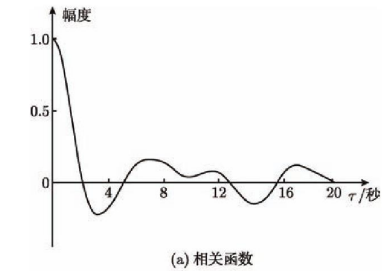
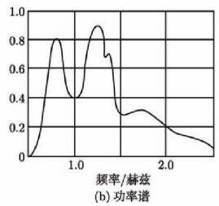
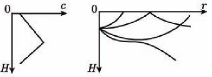
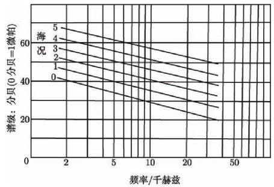
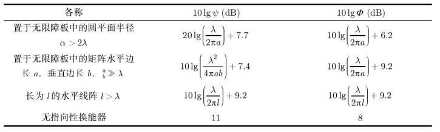

> TIME： 2023.11.27，Monday，🌞

# 声呐系统

声呐是一种利用声波在水中的传播和反射特性，通过电声转换和信息处理进行导航和测距的设备。声波是人类目前(截至2023年11月)掌握的唯一一种能够在水中远距离传播的技术手段。

本节归纳声呐系统的基本结构、声呐方程的定义、水声信道的特征和水声信道的噪声组成。

## 声呐系统结构

声呐系统的组成与常规通信系统的差异不大，值得注意的是“波束成形”，这也将是作者在后续将会通过一整个章节着重介绍的部分。

* 发射机：信号发生器$\to$波束成形$\to$功率放大$\to$发射基阵

  * 信号发生器： 模拟/数字，CW/CHRIP

  * 波束成形：给信号一个合适的加权和延时，控制发射机发射声能的集中程度和空间分布情况

  * 发射基阵：电声转换的辐射单元的综合

* 接收机：接收基阵$\to$动态范围压缩$\to$波束成形$\to$信号处理

  * 接收基阵：声电转换的接受单元的综合

  * 动态范围压缩：自动增益控制AGC与时变增益放大TVG

## 声呐方程

声呐方程与无线通信/光纤通信中“通信链路预算”的概念很接近。声呐方程总结了声呐工作过程中相关的功率性参数。

| 声呐类型 | 声呐方程               | 优质因数                    |
| -------- | ---------------------- | --------------------------- |
| 主动声呐 | $SL-2L+TS+GS+GT-NL=DT$ | $FOM=(SL+TS-NL+GS+GT-DT)/2$ |
| 被动声呐 | $SL-NL-TL+GS+GT=DT$    | $FOM = SL-NL+GS+GT-DT$      |

其中：

* 声呐系统决定的参数

  $SL$：发射时的指标声压，离发射换能器1米处所能接收到的声压。$SL = 171.5+10lgP+DI \quad(dB)$

  $GS$：声呐系统的空间增益。

  $GT$：声呐系统的时间增益。

  $DT$：检测阈值，类似灵敏度。

* 目标决定的参数

  $SL$：辐射噪声源的指标声压级，离辐射源1米处所能接收到的声压。

  $TS$：目标强度，目标截获声能并将之重新辐射的能力。

* 环境决定的参数

  $NL$：背景噪声级，自然噪声+混响+舰艇的自噪声。

  $TL$：传播损失。

## 水声信道

对于水声信道的分析需要关注水声信道自身的特性，声波在信道中的传播速度、损耗与轨迹，以及在水声信道中存在的各类噪声。

### 水声信道的特征

水声信道由海面+海水+海底构成。这里我们关心海面与海底两个界面。

定点观察海面，可以发现海面的波浪是一个局部平稳的随机过程，纽曼公式给出了海浪谱的相关的估计
$$
S(\omega) = \frac{c_1}{4\omega^6}\mathrm{exp}\left(-\frac{2g^2}{\omega^2u^2}\right) \tag 1
$$
其中，$c_1=4.8$米/秒^2^，$g=9.8$ 米/秒^2^，$u$为风速（米/秒），$\omega$为角频率（弧度/秒）。

对于海底，大部分浅海大陆架属于高声速海底（即c~底~>c~水~），大部分深海沉积层属于低声速海底（即c~底~<c~水~）

### 声波在水声信道中的特性

声波在水中传播速度的经验公式为

淡水：
$$
c = 1410 + 4.21t-0.037t^2+0.018d \quad(米/秒) \tag 2
$$
海水：
$$
c = 1410 + 4.21t-0.037t^2+1.1s+0.018d\quad (米/秒) \tag 3
$$
其中，$t$为水温（℃），$d$为水深，$s$为盐度（‰）。

典型的深海声速断面如下图所示。当超过一定深度，进入海水等温层，声速只与深度线性相关。

-------------------------------------

声波在海洋中传播时会存在一定损耗，损耗来源包括：

* 波阵面的几何拓展

* 声波在海面和海底边界的损失

* 散射

* 吸收

  声吸收系数$\alpha$与频率$f$有关。当$f\le10$kHz时，使用梅伦公式估算:
  $$
  \alpha = \frac{Af^2}{1+Bf^2} + 0.0035 f^2 \quad (分贝/千米) \tag 4
  $$
  其中，$A=0.11\times10^{pH-8}/f_r$，$B=(1/f_r)^2$。$f_r$为海水的弛豫频率，$f_r = 10^{(T-4)/100}$（kHz），$T$是水温（℃）。

----------------------------------

如果使用[波动理论的波动方程](https://zh.wikipedia.org/wiki/%E6%B3%A2%E5%8A%A8%E6%96%B9%E7%A8%8B)分析声波的传播，可以得到声压为
$$
p = \frac{p_0}{r}e^{j(\omega t-k)},\quad k=\omega/c \tag 5
$$
其中，$p_0$为常数，$k$为波数。可见球面波的声压与距离$r$成反比。

如果使用射线理论分析声波在线性声速断面（$c=A+gz$）中的运动轨迹，可以得到轨迹
$$
z = -\frac{c_0}{g}(1-cos\theta) \tag 6
$$
可见，声波的传播轨迹是一条弧线。当$g>0$，弧线朝上弯曲，反之，弧线朝下弯曲。

### 水声信道中的噪声

#### 海洋噪声(自然噪声)

包括：地震及海床活动、船动力及海上施工、刮风下雨、生物噪声、分子热运动等。

海洋噪声可以视作一个具有高斯分布的随机信号，**一小个区域内**可以视作各向同性均匀的噪声场，噪声场的时-空相关函数为
$$
R(r,\tau) = \frac{c}{2r}\int^{\tau+\frac{r}{c}}_{\tau-\frac{r}{c}}R(0, t)dt
$$
因此，只需要一个水听器记录的噪声数据，并计算相关函数，即可得到噪声场的时-空相关函数。

--------------------------------

海洋噪声的测试频谱近似于一条直线

噪声谱的平均功率谱实测数据可以拟合为
$$
K_n(f) = K_n(f_0)(f_0/f)^{k/3} \tag 7
$$
那么在频带$(f_1, f_2)$的噪声功率为
$$
P = 10lg\int^{f_2}_{f_1}K_n(f)df = N(f_0)+10lg \left\{ \frac{f_0}{1+\frac{k}{3}} \left[ \left( \frac{f_2}{f_0}\right)^{\frac{k}{3}+1}-\left( \frac{f_1}{f_0}\right)^{\frac{k}{3}+1} \right]  \right\} \tag 8
$$
然而实际海洋噪声并不是理想得各向同性均匀的噪声场，他们总有一定的指向性。

#### 混响

混响是声波在传播过程中的散射在接收点的总和，它是由声呐系统自身引起的，[该文献](https://kns.cnki.net/kcms2/article/abstract?v=aGn3Ey0ZxcDgOfbyu_BAyktfJiFbjr17yLKs7QcHfg6PXf-55ien0EIpG384WFwIuUU_dTAERH9jvhqvJGMAoZAKW5M4cTNlqL29Sf3A3JsGqsGuVQ1FxRfdQJ26b3lW&uniplatform=NZKPT&flag=copy)有更深入的阐述。

混响由体积混响和界面混响（海面混响+海底混响）构成。其中体积混响和海面混响的振幅服从瑞利分布，相位服从$(0,2\pi)$内的均匀分布；海底混响的声压为有规信号。三者的合成混响的振幅服从莱斯分布

散射强度定义为单位面积或体积在参考距离1m处所散射的强度与入射平面波强度的比值
$$
S = 10lg(I_散/I_入) \tag 9
$$
体积混响级为
$$
RL_v = SL-40\mathrm{lg}r+S_v+10lgV \tag {10}
$$
其中，$V=\frac{c\tau}{2}\psi r^2\\$，其中$\tau$是脉冲宽度，$\psi$为等效合成束宽。

界面混响为
$$
RL_s = SL-40\mathrm{lg}r+S_s+10lgA \tag {11}
$$
其中，$A=\frac{c\tau}{2}\Phi r\\$，其中$\Phi$为等效合成束宽。

$\psi$和$\Phi$可以查询

