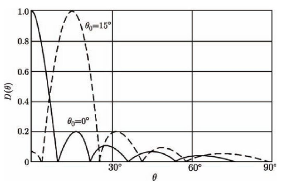
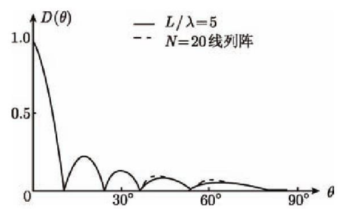
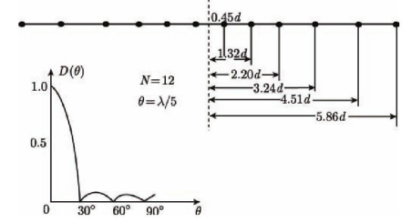

> TIME：2023.12.14，Thursday，🌞

# 波束成形

在[声呐系统的接收机](public_docs/dsp/sonar_signal_processing/声呐系统介绍.md)中，第三个环节就是波束成形。因为波束成形能够提高信噪比，并得到较高的目标分辨力。

如果我们的声呐只有一个单元，那么来自四面八方的声音信号都是“地位”相同的，我们在处理他们时有着相同的增益。然而现实是，我们常常并不需要监听全方位的信号而总是对来自某些方向的信号特别感兴趣，因此我们自然希望在这些方向上能够获得更大的增益。但是，事物是守恒的，我们在感兴趣的方向上获得更大的增益后，剩余方向的增益自然就会减小。所幸的是，这些减小的方向并我们往往不感兴趣。

波束成形的基本实现方式是通过对来自不同方向上被接收单元接收的信号进行加权、延时和求和。与波束成形所密切相关的指标是接收基阵的指向性函数，它描述了在某些方向上信号的增益大小。波束成形器可以看成是一个空间域滤波器，对来自不同方向的信号进行阻/通。

# 普通波束成形模型

各个接收单元之间的距离导致他们各自接收到的信号存在一个延时$\tau_i(\theta)$。普通的波束成形的思想是对这个延时进行补偿使得每一个输出都一样，这样输出信号就是
$$
y(t) = \sum_{i=1}^Ns[t+\tau_i(\theta)-\tau_i(\theta_0)]+\sum_{i=1}^Nn_i[t-\tau_i(\theta_0)] \tag 1
$$
其中$\tau_i(\theta_0)$是补偿时延，$\theta_0$就是波束成形器的指向角。

根据[海洋噪声的性质]((public_docs/dsp/sonar_signal_processing/声呐信道.md))可知，如果两个接收基元之间的距离大于半波长，接收的海洋噪声之间便近似独立，则$\displaystyle\frac{1}{N}\sum_{i=1}^Nn_i[t-\tau_i(\theta_0)] \to 0$。因此只要$N$足够大，输出噪声将被抑制为0。

我们也很容易算出在[被动声呐信号检测]((public_docs/dsp/sonar_signal_processing/声呐信号检测理论.md))下，波束成形带来的增益为
$$
G_s = \frac{S_o/N_o}{S_i/N_i} = \frac{N^2\sigma_s^2}{N\sigma_n^2} / \frac{\sigma_s^2}{\sigma_n^2} = N\tag2
$$
也就是说，我们声呐的基元越多，获得的增益也就越大。

## 线阵

线阵的分析方式与普通模型一致，根据间隔直接计算时延即可。

|           类型           |                          指向性函数                          |
| :----------------------: | :----------------------------------------------------------: |
|  基元等间隔相等的线列阵  | $\displaystyle D(\theta) = \left\vert \frac{\mathrm{sin}\left[ N\pi\frac{d}{\lambda}(\mathrm{sin}\theta-\mathrm{sin}\theta_0) \right]}{ N\mathrm{sin}\left[\pi\frac{d}{\lambda}(\mathrm{sin}\theta-\mathrm{sin}\theta_0) \right]} \right\vert$ |
|         连续线阵         | $\displaystyle D(\theta) = \left\vert \mathrm{Sa}(L\frac{\pi}{\lambda}(\mathrm{sin}\theta-\mathrm{sin}\theta_0)) \right\vert$ |
| 基元不等间隔相等的线列阵 | $\displaystyle D(\theta) = \frac{1}{N}\left[ \left( \sum_{i=1}^N \mathrm{cos}\varphi_i \right)^2 + \left( \sum_{i=1}^N \mathrm{sin}\varphi_i \right)^2 \right]^{1/2}$ |

### 基元等间隔相等的线列阵

考虑以下基元等间隔相等的线列阵。

第$i$个接收基元的时延为$\tau_i(\theta) = (i-1)d\mathrm{sin}\theta/c$，那么补偿为$\tau_i(\theta_0) = (i-1)d\mathrm{sin}\theta_0/c$

那么和信号为
$$
y(t) = \sum_{i=1}^NA\mathrm{cos}\left[ 2\pi ft + 2\pi(\tau_i(\theta)-\tau_i(\theta_0)) \right] = A\mathrm{cos}\left[ 2\pi ft +(N-1)\pi\frac{d}{\lambda}(\mathrm{sin}\theta-\mathrm{sin}\theta_0) \right] \frac{\mathrm{sin}\left[N\pi\frac{d}{\lambda}(\mathrm{sin}\theta-\mathrm{sin}\theta_0)\right]}{\mathrm{sin}\left[\pi\frac{d}{\lambda}(\mathrm{sin}\theta-\mathrm{sin}\theta_0)\right]} \tag 3
$$
则指向性函数为
$$
D(\theta) = \left| \frac{\mathrm{sin}\left[ N\pi\frac{d}{\lambda}(\mathrm{sin}\theta-\mathrm{sin}\theta_0) \right]}{ N\mathrm{sin}\left[\pi\frac{d}{\lambda}(\mathrm{sin}\theta-\mathrm{sin}\theta_0) \right]} \right| \tag 4
$$

### 连续线阵

当基元间隔$d$足够小时，基元数量$N$足够多，离散阵便成为了连续阵，$Nd\to L$。

那么连续阵的指向性函数就是
$$
\displaystyle D(\theta) = \left| \frac{\mathrm{sin}\left[ L\frac{\pi}{\lambda}(\mathrm{sin}\theta-\mathrm{sin}\theta_0) \right]}{ L\frac{\pi}{\lambda}(\mathrm{sin}\theta-\mathrm{sin}\theta_0)} \right| = \left| \mathrm{Sa}(L\frac{\pi}{\lambda}(\mathrm{sin}\theta-\mathrm{sin}\theta_0)) \right| \tag 5
$$
利用$\mathrm{Sa}(\cdot)$的性质我们可以得知线性阵的主要参数有

* 第一旁瓣：$22\%$，$\displaystyle\theta_1=\mathrm{arcsin}\left( 1.43\frac{\lambda}{L} \right) \approx 1.43\frac{\lambda}{L}\quad \mathrm{with.} \frac{\lambda}{L} \gg 1$
* 主瓣宽度：$\displaystyle \mathrm{sin}\theta-\mathrm{sin}\theta_0 = 0.44\frac{\lambda}{L}$
* 聚集系数：$\displaystyle \mu = \left\{ \frac{\lambda}{\pi L}\left[ s_i\left( \frac{2\pi L}{\lambda} \right) -\frac{\lambda}{\pi L} \mathrm{sin}^2\frac{\pi L}{\lambda}\right] \right\}^{-1}$， 其中$\displaystyle s_i(x) = \int_0^x\frac{\mathrm{sin}\mu}{\mu}d\mu$

### 基元不等间隔相等的线列阵

为了得到更窄得主瓣宽度或更低的旁瓣高度，我们有时需要调整基元之间的距离以获得更合适的指向性函数。

以同样的推导方式，我们得到基元不等间隔相等的线列阵的指向性函数为
$$
D(\theta) = \frac{1}{N}\left[ \left( \sum_{i=1}^N \mathrm{cos}\varphi_i \right)^2 + \left( \sum_{i=1}^N \mathrm{sin}\varphi_i \right)^2 \right]^{1/2} \tag 6
$$
其中$\displaystyle \varphi = 2\pi f\frac{H_1H_i \mathrm{sin}\theta}{c}$。

基元数量相等时，中间密两边疏时，主瓣宽，旁瓣低。反之，对应变化。

