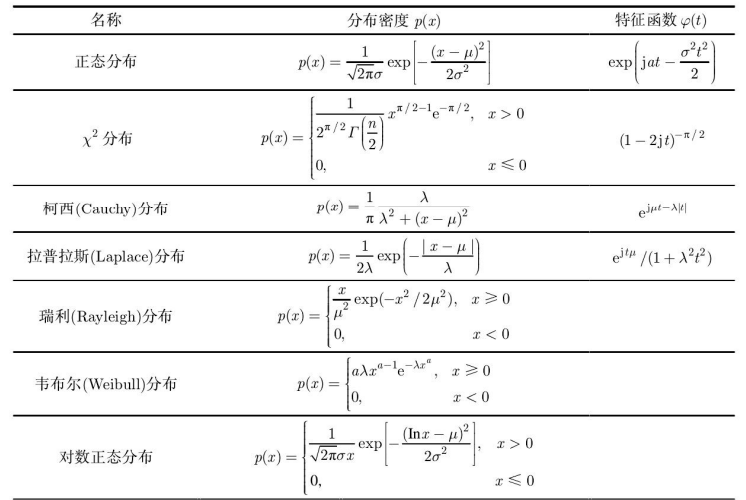

> TIME： 2023.11.25，Saturday，🌞

# 概率论基础

学好数理化，走遍天下都不怕。

概率论是信号处理的基础。所以借此先简要回顾了一些概率论中的定义、定理。

## 概率

* 概率的定义：古典概型、几何定义、统计定义$\to P(\cdot)$

  对任意两个集合$A$与$B$，有
  $$
  P(A+B) = P(A) + P(B) - P(AB) \tag 1
  $$

* 条件概率的定义为
  $$
  P(A|B) = \frac{P(AB)}{P(B)} \tag 2
  $$
  贝叶斯公式：设$B_1, \cdots，B_n$是$n$个不相交的集合，$\displaystyle{\sum^{n}_{i=1} B_i = X}$，那么对任一事件$A$，是要$P(A) \gt 0$， 有
  $$
  P(B_i|A) = \frac{P(A|B_i)P(B_i)}{\displaystyle{\sum^n_{k=1}P(A|B_k)P(B_k)}}, \quad i=1,\cdots,n \tag 3
  $$
  贝叶斯公式给出了$P(A|B_k) \Leftrightarrow P(B_i|A)$的转换方法。

* 独立性的定义为
  $$
  P(AB) = P(A)P(B) \tag 4
  $$

## 随机变量

* 随机变量$\xi(\omega)$的分布函数$F(x)$的定义为
  $$
  F(x) = P\{ \xi(\omega) \le x \}, \quad x\in R_1 = (-\infin, +\infin) \tag 5
  $$
  对于离散随机变量，使用取值集合$\begin{Bmatrix} a_1, a_2, \cdots\end{Bmatrix}$与对应的概率$p_i = P\{\xi(\omega)=a_i\}$描述即可，有
  $$
  \begin{pmatrix}
  a_1, & a_2, &\cdots \\
  p_1, & p_2, &\cdots 
  \end{pmatrix}  \tag 6
  $$
  对于连续随机变量，使用概率密度函数$p(x)$以形容
  $$
  p(x) = \frac{dF(x)}{dx} \tag 7
  $$

* 独立随机变量

  如果随机变量$\xi_1(\omega),\cdots,\xi_n(\omega)$是相互独立的，那么有
  $$
  P\{ \xi_1(\omega)\le x_1,\cdots,\xi_n(\omega)\le x_n\} = P\{\xi_1(\omega)\le x_1\}\cdots P\{\xi_n(\omega)\le x_n\} \\
  F(x_1,\cdots,x_n) = F_1(x_1)\cdots F_n(x_n) \\
  p(x1,\cdots,x_n) = p_1(x_1)\cdots p_n(x_n) \tag 8
  $$
  若$\varphi_1(x),\cdots,\varphi_n(x)$是$\mathbb{R}$上的实函数，则$\varphi_1[\xi_1(\omega)],\cdots,\varphi_n[\xi_n(\omega)]$也是相互独立的。

* 随机变量的数学特征

  期望
  $$
  E(\xi_1+\xi_2) = E(\xi_1)+E(\xi_2) \tag 9
  $$
  $$
  E[f(\xi)] = \int^{\infin}_{-\infin} f(x)p(x)dx \tag {10}
  $$
  
  $$
  [E(\xi)]^2 \le E(\xi^2) \tag {11}
  $$
  
  $$
  |E(\xi_1\xi_2)| \le \sqrt{E(\xi_1^2)E(\xi_2^2)} \tag{12}
  $$
  
  方差
  $$
  D(\xi) = E(\xi^2)-[E(\xi)]^2 \tag{13}
  $$
  若$\xi_1,\xi_2$相互独立，则
  $$
  E(\xi_1\xi_2) = E(\xi_1)E(\xi_2) \\
  D(\xi_1+\xi_2) = D(\xi_1)+D(\xi_2) \tag {14}
  $$
  协方差的定义为
  $$
  Cov(\xi, \eta) = E\{ [\xi-E(\xi)][\eta-E(\eta)] \} = E(\xi\eta) - E(\xi)E(\eta) \tag{15}
  $$
  相关系数（归一化协方差）的定义为
  $$
  \rho(\xi,\eta) = \frac{Cov(\xi,\eta)}{\sqrt{D(\xi)D(\eta)}} \tag{16}
  $$
  特征函数的定义为
  $$
  \varphi(t) = E[e^{jt\xi}] \tag{17}
  $$

## 大数定理与中心极限定理

* **切比雪夫不等式**

  设随机变量$\xi$的方差$D(\xi)$存在，那么
  $$
  P(|\xi-E(\xi)| \ge \varepsilon) \le \frac{D(\xi)}{\varepsilon^2} \tag{18}
  $$

* **大数定理**：揭示了在同一条件下，独立地进行多次试验，当试验次数非常大时，试验结果与它地真正地平均值地偏离较大地概率时很小的。

  切比雪夫大数定理：设有独立的随机变量序列$\xi_k$（其中$k=1,2,\cdots$），如果存在常数$C$,使得对一切$k$,$D(\xi_k)\le C$，那么
  $$
  \displaystyle \lim_{n\to\infin}P\left(\left\vert\frac{1}{n}\sum_{k=1}^n[\xi_k - E(\xi_k)]|\right\vert\ge \varepsilon\right) = 0 \tag{19}
  $$
  伯努利大数定理：在伯努利二项式分布中，如果事件$A$出现的概率为$p$，$0\le p \le 1$，用$\xi_n$表示前$n$次实验中$A$出现的次数，那么对任意$\varepsilon > 0$，有
  $$
  \lim_{n\to\infin} P\left(\left\vert \frac{\xi_n}{n} - p \right\vert \ge \varepsilon \right) = 0 \tag{20}
  $$
  **辛钦大数定理：设$\xi_k$是相互独立的随机变量序列并且具有相同的分布函数，$E(\xi_k) = u,(k=1,2,\cdots)$，那么**
  $$
  \lim_{n\to\infin} P \left(\left\vert \frac{1}{n}\sum^n_{k=1} \xi_k - \mu \right\vert \ge \varepsilon \right) = 0 \tag{21}
  $$

* **中心极限定理**：表明凡是由大量的相互独立的随机因素合成的结果都趋于正态分布。

  设独立的随机变量序列$\xi_k(k=1,2,\cdots)$有相同的分布，$D(\xi_k)=\sigma^2$存在，$E(\xi_k) = \mu$，那么
  $$
  \lim_{n\to\infin} P \left( \frac{1}{\sqrt{n}\sigma}\sum^n_{k=1}(\xi_k - \mu) \le x \right) = \frac{1}{\sqrt{2\pi}}\int^{x}_{-\infin} e^{-z^2/2}dz \tag{22}
  $$

# 常用分布的数学特征

